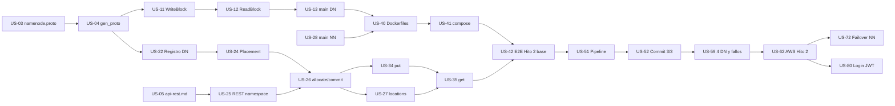

# DFSha — Backlog del equipo (features e historias de usuario)

Equipo: **Carlos, James, David, Felipe**.
Fuente: enunciado `ST0263-SI3007-26-22-Proyecto1-DFS.pdf`, diagramas de `documentation/diagrams/` y la estructura del repo.

---

## 1. Cómo leer este documento

Cada historia tiene:

| Campo | Significado |
|---|---|
| **ID** | `US-XX`. Úsalo en el issue, la rama y el commit. |
| **Feature** | Agrupación grande (épica). Se mapea a un hito. |
| **Responsable** | Quien la implementa y abre el PR. |
| **Revisor** | Quien aprueba el PR (nunca el mismo responsable). |
| **Depende de** | Historias que deben estar **mergeadas en `main`** antes de empezar. |
| **Puntos** | Esfuerzo relativo: 1 (horas), 2 (1 día), 3 (2 días), 5 (3–4 días), 8 (semana). |
| **Archivos** | Archivos que toca. Si un archivo es de otra persona, se coordina antes. |
| **Criterios de aceptación** | Checklist verificable. El PR no se mergea si falta uno. |

Requisitos del enunciado que cubre cada feature:

| Feature | Hito | RF / RNF |
|---|---|---|
| F0 Setup y contratos | 2 | Especificación de comunicaciones |
| F1 DataNode | 2 | RF2, RNF4 |
| F2 NameNode | 2 | RF1, RF2, RNF1 |
| F3 Cliente CLI | 2 | RF1, RF2, RNF7 |
| F4 Docker local | 2 | Infraestructura |
| F5 Partición y réplica | 2–3 | RNF2, RNF3, RNF4, RNF5 |
| F6 AWS | 2–4 | Infraestructura |
| F7 Alta disponibilidad | 3 | RNF2 |
| F8 Seguridad | 3 | RNF6 |
| F9 Calidad y entrega | 4 | Informe, video, repositorio |

---

## 2. Áreas y dueños de archivos

Cada persona es **dueña** de un área. Solo el dueño edita esos archivos; si otro necesita un cambio, lo pide en el issue o en un PR que el dueño revisa. Esto es lo que más evita conflictos en GitHub.

| Persona | Área | Archivos de los que es dueño |
|---|---|---|
| **Felipe** | Contratos, cliente Python, integración, documentación final | `proto/**`, `scripts/**`, `client/**`, `README.md` |
| **Carlos** | DataNode (Go) | `services/cmd/datanode/**`, `services/internal/datanode/**`, `services/internal/common/config.go`, `services/internal/common/checksum.go` |
| **James** | NameNode: metadatos, REST, HA | `services/cmd/namenode/**`, `internal/namenode/namespace.go`, `blockmap.go`, `rest.go`, `editlog.go`, `ha.go` |
| **David** | NameNode: DataNodes y colocación, seguridad, infraestructura | `internal/namenode/datanodes.go`, `placement.go`, `grpc_server.go`, `auth.go` (nuevo), `services/internal/common/security.go`, `services/Dockerfile.*`, `docker-compose.yml`, `deploy/**`, `.env.example` |

Archivos compartidos y su regla:

- **`proto/*.proto` y `services/gen/`, `client/gen/`**: solo Felipe los modifica. Cualquier cambio de contrato es una historia propia, se mergea primero y los demás hacen `git pull` antes de seguir.
- **`services/go.mod` y `go.sum`**: quien añade una dependencia lo hace en su PR. Si hay conflicto, se resuelve corriendo `go mod tidy`, nunca editando a mano.
- **`internal/namenode/grpc_server.go`**: es de David (servicio `NameNode`). El servicio `NameNodeHA` de James vive en `ha.go` para no tocar el mismo archivo.
- **Login y JWT**: van en `internal/namenode/auth.go` (David), no en `rest.go` (James). James solo registra las rutas que David expone.

---

## 3. Flujo de trabajo en GitHub

### Ramas

- `main` está protegida: no se hace push directo, solo PR con 1 aprobación y CI en verde (cuando exista).
- Una rama por historia: `feature/US-11-writeblock`, `fix/US-34-put-reintento`, `docs/US-95-informe`.
- Ramas cortas: si una historia pasa de 4 días, se parte.

### Antes de empezar una historia

1. Verifica en el tablero que **todas sus dependencias estén en "Done"** (mergeadas).
2. `git checkout main && git pull`.
3. `git checkout -b feature/US-XX-nombre`.
4. Mueve el issue a "In progress" y asígnatelo.

### Mientras trabajas

- Commits pequeños con el ID: `US-11: valida checksum en WriteBlock`.
- Cada día: `git fetch && git rebase origin/main` (o `merge`) para traer lo que mergearon los demás.
- Si necesitas algo de una historia que aún no está, **no copies su código**: trabaja contra el contrato (proto o `api-rest.md`) con un stub o mock, y lo conectas cuando se mergee.

### Pull request

- Título: `US-XX: título de la historia`. Descripción con `Closes #<issue>` y cómo probarlo.
- Checklist del PR = criterios de aceptación de la historia.
- Revisor según la tabla de revisores (abajo). Máximo 24 h para revisar.
- Merge con **squash**. Después se borra la rama.

### Revisores por defecto

| Autor | Revisor principal | Por qué |
|---|---|---|
| Felipe | James | El cliente consume la REST de James |
| Carlos | David | Pipeline y heartbeat cruzan con el registro de DataNodes |
| James | Felipe | La REST la consume el cliente |
| David | Carlos | Infra y colocación afectan al DataNode |

### Etiquetas sugeridas

`feature:F0` … `feature:F9`, `hito-2`, `hito-3`, `hito-4`, `go`, `python`, `infra`, `docs`, `blocked`, `contract-change`.

### Tablero (GitHub Projects)

Columnas: **Backlog → Ready (dependencias listas) → In progress → In review → Done**. Milestones: `Hito 2`, `Hito 3`, `Hito 4`.

---

## 4. Definición de terminado (aplica a todas las historias)

- [ ] Todos los criterios de aceptación de la historia se cumplen.
- [ ] `go build ./...` y `go vet ./...` pasan en `services/` (si toca Go).
- [ ] El cliente arranca sin errores de import (si toca Python).
- [ ] Hay al menos una prueba (unitaria o manual documentada en el PR).
- [ ] No hay secretos, IPs fijas ni rutas de la máquina de alguien en el código.
- [ ] Se actualizó el documento correspondiente si cambió un contrato o un comando.
- [ ] PR aprobado por el revisor y mergeado en `main`.

---

## 5. Camino crítico

Si una de estas historias se atrasa, se atrasa todo el equipo. Tienen prioridad en revisión.

---

## 6. Features e historias

### F0 — Setup y contratos

#### US-01 Entorno de desarrollo reproducible
- **Responsable:** David · **Revisor:** Carlos · **Puntos:** 2 · **Hito:** 2
- **Depende de:** —
- **Archivos:** `README.md` (sección "Requisitos", coordinar con Felipe), `.env.example`
- **Historia:** Como desarrollador del equipo, quiero instrucciones exactas para instalar Go, protoc, plugins, Python y Docker, para que los 4 tengamos el mismo entorno y nadie pierda tiempo con errores de versión.
- **Criterios de aceptación:**
  - [ ] El README lista versiones mínimas: Go 1.22+, protoc 25+, `protoc-gen-go`, `protoc-gen-go-grpc`, Python 3.12, Docker Desktop.
  - [ ] Incluye los comandos de instalación de plugins y de creación del `venv`.
  - [ ] Advierte no trabajar el repo dentro de OneDrive ni en rutas con espacios.
  - [ ] Los 4 integrantes confirman en el issue que `go build ./...` en `services/` y `pip install -r client/requirements.txt` funcionan.

#### US-02 Repositorio y tablero de trabajo
- **Responsable:** Felipe · **Revisor:** James · **Puntos:** 1 · **Hito:** 2
- **Depende de:** —
- **Archivos:** `.github/pull_request_template.md`, `.github/ISSUE_TEMPLATE/historia.md`
- **Historia:** Como equipo, queremos `main` protegida, plantillas de issue/PR y un tablero con estas historias, para trabajar en paralelo sin pisarnos.
- **Criterios de aceptación:**
  - [ ] `main` exige PR y 1 aprobación; no se permite push directo.
  - [ ] Existe una plantilla de PR con checklist de la definición de terminado.
  - [ ] Hay un issue por cada historia de este documento, con etiqueta de feature, milestone y responsable.
  - [ ] El tablero tiene las columnas Backlog, Ready, In progress, In review, Done.

#### US-03 Contrato gRPC del NameNode
- **Responsable:** Felipe · **Revisor:** David · **Puntos:** 2 · **Hito:** 2
- **Depende de:** —
- **Archivos:** `proto/namenode.proto`
- **Historia:** Como desarrollador de NameNode y DataNode, quiero un contrato gRPC cerrado para registro, heartbeat, block reports y HA, para implementar ambos lados en paralelo.
- **Criterios de aceptación:**
  - [ ] Servicio `NameNode` con `Register`, `Heartbeat`, `BlockReport`, `BlockReceived`.
  - [ ] `HeartbeatResponse` trae una lista de `Command` (`ReplicateCommand`, `DeleteCommand`) y `registered`.
  - [ ] Servicio `NameNodeHA` con `ReplicateEditLog` y `Ping`; `EditLogEntry` con `txid` creciente y las operaciones mkdir, delete, allocate, commit, finalize.
  - [ ] Reutiliza `dfsha.datanode.v1.DataNodeEndpoint` vía `import`.
  - [ ] `protoc` compila ambos archivos sin errores.

#### US-04 Generación de código desde proto
- **Responsable:** Felipe · **Revisor:** Carlos · **Puntos:** 2 · **Hito:** 2
- **Depende de:** US-01, US-03
- **Archivos:** `scripts/gen_proto.ps1`, `scripts/gen_proto.sh`, `services/gen/**`, `client/gen/**`, `services/go.mod`
- **Historia:** Como desarrollador, quiero un comando que genere los stubs Go y Python, y que el código generado esté en el repo, para que nadie tenga que correr protoc para compilar.
- **Criterios de aceptación:**
  - [ ] `scripts/gen_proto.ps1` (Windows) y `.sh` (Linux/AWS) generan en `services/gen/` y `client/gen/`.
  - [ ] Los imports del Python generado funcionan (`namenode_pb2_grpc` encuentra `datanode_pb2`).
  - [ ] `go.mod` incluye `google.golang.org/grpc` y `google.golang.org/protobuf`.
  - [ ] `go build ./...` pasa usando el código generado.
  - [ ] El README explica: "si cambias un `.proto`, corre el script y commitea lo generado en el mismo PR".

#### US-05 Contrato REST del NameNode
- **Responsable:** James · **Revisor:** Felipe · **Puntos:** 2 · **Hito:** 2
- **Depende de:** —
- **Archivos:** `documentation/api-rest.md`
- **Historia:** Como desarrollador del cliente, quiero la especificación exacta de la API REST, para programar el CLI sin esperar a que el NameNode esté listo.
- **Criterios de aceptación:**
  - [ ] Documenta método, ruta, body, respuesta y códigos de error de: `POST /auth/login`, `GET /fs/ls`, `POST /fs/mkdir`, `DELETE /fs/rmdir`, `DELETE /fs/rm`, `POST /files/allocate`, `POST /files/commit`, `POST /files/finalize`, `GET /files/locations`.
  - [ ] `allocate` devuelve `blockId`, `offset`, `size` y `pipeline` (lista ordenada de `{id, host, port, rack}`).
  - [ ] Define formato de error común: `{"error": "...", "code": "..."}`.
  - [ ] Define el `503` que devuelve un NameNode standby (para el failover).
  - [ ] Sirve como sección "Especificación de APIs" del informe.

#### US-06 Configuración y checksum compartidos (Go)
- **Responsable:** Carlos · **Revisor:** James · **Puntos:** 2 · **Hito:** 2
- **Depende de:** US-01
- **Archivos:** `services/internal/common/config.go`, `services/internal/common/checksum.go`
- **Historia:** Como desarrollador de servicios, quiero leer la configuración de variables de entorno y calcular SHA-256 con un mismo código, para que NameNode y DataNode no dupliquen lógica.
- **Criterios de aceptación:**
  - [ ] Lee `NODE_ID`, `RACK`, `GRPC_PORT`, `REST_PORT`, `DATA_DIR`, `NAMENODE_ADDRS` (lista), `ADVERTISE_ADDR`, `BLOCK_SIZE_MB`, `REPLICATION_FACTOR`, con valores por defecto.
  - [ ] `ADVERTISE_ADDR` es la dirección que el nodo anuncia (necesaria para Docker y AWS).
  - [ ] Función de SHA-256 en hexadecimal para `[]byte` y para `io.Reader`.
  - [ ] Pruebas unitarias del checksum con un valor conocido.

---

### F1 — DataNode (almacenamiento de bloques)

#### US-10 Almacenamiento local de bloques
- **Responsable:** Carlos · **Revisor:** David · **Puntos:** 3 · **Hito:** 2
- **Depende de:** US-06
- **Archivos:** `services/internal/datanode/storage.go`
- **Historia:** Como DataNode, quiero guardar, leer, listar y borrar bloques en disco de forma segura, para no dejar bloques corruptos si algo falla a mitad de una escritura.
- **Criterios de aceptación:**
  - [ ] Escribe en un temporal y renombra al terminar (escritura atómica).
  - [ ] Guarda el checksum y el tamaño junto al bloque (archivo `.meta` o equivalente).
  - [ ] `List()` devuelve id, tamaño y checksum de todos los bloques (para el block report).
  - [ ] Es seguro con escrituras concurrentes de bloques distintos.
  - [ ] Pruebas unitarias: guardar, leer, borrar, y que un temporal a medias no aparezca en `List()`.

#### US-11 WriteBlock (sin pipeline)
- **Responsable:** Carlos · **Revisor:** David · **Puntos:** 3 · **Hito:** 2
- **Depende de:** US-04, US-10
- **Archivos:** `services/internal/datanode/grpc_server.go`
- **Historia:** Como cliente, quiero enviar un bloque por streaming a un DataNode, para almacenar partes de un archivo.
- **Criterios de aceptación:**
  - [ ] El primer mensaje debe ser `header`; si no, devuelve `InvalidArgument`.
  - [ ] Si el checksum o el tamaño recibidos no coinciden con el header, devuelve error y no guarda nada.
  - [ ] Responde `bytes_written`, `checksum_sha256` y `replica_ids` con su propio id.
  - [ ] El campo `pipeline` se ignora en esta historia (se implementa en US-51).

#### US-12 ReadBlock
- **Responsable:** Carlos · **Revisor:** David · **Puntos:** 2 · **Hito:** 2
- **Depende de:** US-11
- **Archivos:** `services/internal/datanode/grpc_server.go`
- **Historia:** Como cliente, quiero leer un bloque por streaming, para reconstruir un archivo.
- **Criterios de aceptación:**
  - [ ] Envía primero `header` (id, tamaño, checksum) y luego chunks de ~64 KB.
  - [ ] Soporta `offset` y `length` (0 = hasta el final).
  - [ ] Bloque inexistente devuelve `NotFound`.
  - [ ] Si el checksum del bloque en disco no coincide, devuelve `DataLoss` (el cliente probará otra réplica).

#### US-13 Binario y arranque del DataNode
- **Responsable:** Carlos · **Revisor:** David · **Puntos:** 1 · **Hito:** 2
- **Depende de:** US-11, US-12
- **Archivos:** `services/cmd/datanode/main.go`
- **Historia:** Como operador, quiero arrancar un DataNode con variables de entorno, para levantarlo igual en local, Docker o AWS.
- **Criterios de aceptación:**
  - [ ] `go run ./cmd/datanode` levanta el servidor gRPC en `GRPC_PORT` usando `DATA_DIR`.
  - [ ] Registra en el log id, rack, puerto y dirección anunciada.
  - [ ] Se cierra limpiamente con Ctrl+C.
  - [ ] Prueba manual documentada: escribir y leer un bloque con un script Python (US-32).

#### US-14 Registro y heartbeat hacia el NameNode
- **Responsable:** Carlos · **Revisor:** David · **Puntos:** 3 · **Hito:** 2
- **Depende de:** US-13, US-22
- **Archivos:** `services/internal/datanode/heartbeat.go`, `services/cmd/datanode/main.go`
- **Historia:** Como NameNode, quiero que cada DataNode se registre y me avise que sigue vivo cada 3 s, para saber a quién asignar bloques.
- **Criterios de aceptación:**
  - [ ] Al arrancar llama a `Register` con su endpoint, rack y capacidad; reintenta si el NameNode no está.
  - [ ] Envía `Heartbeat` cada `heartbeat_interval_seconds` con espacio usado/libre.
  - [ ] Si recibe `registered=false`, vuelve a registrarse.
  - [ ] Ejecuta los `Command` que llegan en la respuesta llamando a funciones que, por ahora, solo registran en el log (se implementan en US-55 y US-57).

#### US-15 Aviso de bloque recibido
- **Responsable:** Carlos · **Revisor:** David · **Puntos:** 1 · **Hito:** 2
- **Depende de:** US-14, US-23
- **Archivos:** `services/internal/datanode/heartbeat.go`, `grpc_server.go`
- **Historia:** Como NameNode, quiero enterarme de cada bloque que un DataNode guarda, para saber dónde están las réplicas sin esperar al block report.
- **Criterios de aceptación:**
  - [ ] Tras cada `WriteBlock` exitoso se llama a `BlockReceived` con id, tamaño y checksum.
  - [ ] Si la llamada falla, se reintenta y no se pierde el aviso (cola en memoria).

---

### F2 — NameNode (metadatos)

#### US-20 Namespace jerárquico en memoria
- **Responsable:** James · **Revisor:** Felipe · **Puntos:** 3 · **Hito:** 2
- **Depende de:** US-01
- **Archivos:** `services/internal/namenode/namespace.go`
- **Historia:** Como usuario, quiero un árbol de directorios tipo Linux, para organizar mis archivos.
- **Criterios de aceptación:**
  - [ ] Inodos de tipo directorio y archivo con dueño, fecha, tamaño y estado (`UNDER_CONSTRUCTION`, `COMPLETE`).
  - [ ] `Mkdir` (con opción de crear padres), `List`, `CreateFile`, `Rmdir` (solo vacío), `Delete`.
  - [ ] Rutas normalizadas (`/a//b/../c` → `/a/c`); errores claros para "no existe", "ya existe", "no es directorio".
  - [ ] Protegido con `sync.RWMutex`.
  - [ ] Pruebas unitarias de cada operación y de los errores.

#### US-21 Mapa de bloques
- **Responsable:** James · **Revisor:** David · **Puntos:** 3 · **Hito:** 2
- **Depende de:** US-20
- **Archivos:** `services/internal/namenode/blockmap.go`
- **Historia:** Como NameNode, quiero saber qué bloques forman cada archivo y en qué DataNodes está cada bloque, para responder lecturas y detectar réplicas faltantes.
- **Criterios de aceptación:**
  - [ ] `archivo → []blockId` en orden.
  - [ ] `blockId → {tamaño, checksum, réplicas: set de datanodeId}`.
  - [ ] Funciones: agregar réplica, quitar todas las réplicas de un DataNode, listar bloques con menos de N réplicas.
  - [ ] Pruebas unitarias.

#### US-22 Registro de DataNodes y liveness
- **Responsable:** David · **Revisor:** James · **Puntos:** 3 · **Hito:** 2
- **Depende de:** US-04, US-06
- **Archivos:** `services/internal/namenode/datanodes.go`, `services/internal/namenode/grpc_server.go`
- **Historia:** Como NameNode, quiero registrar DataNodes y marcarlos muertos si dejan de enviar heartbeats, para no asignar bloques a nodos caídos.
- **Criterios de aceptación:**
  - [ ] Implementa `Register` y `Heartbeat` del servicio gRPC `NameNode`.
  - [ ] Guarda id, endpoint anunciado, rack, capacidad, uso y último heartbeat.
  - [ ] Un DataNode sin heartbeat por 3 intervalos (~9 s) pasa a `DEAD`; se registra en el log.
  - [ ] `Alive()` devuelve los nodos vivos.
  - [ ] Cola de comandos por DataNode que se vacía en la respuesta del heartbeat.

#### US-23 Recepción de BlockReceived
- **Responsable:** David · **Revisor:** James · **Puntos:** 1 · **Hito:** 2
- **Depende de:** US-21, US-22
- **Archivos:** `services/internal/namenode/grpc_server.go`
- **Historia:** Como NameNode, quiero registrar cada réplica que un DataNode confirma, para tener el mapa de ubicaciones actualizado.
- **Criterios de aceptación:**
  - [ ] `BlockReceived` agrega el DataNode como réplica del bloque en el blockmap.
  - [ ] Si el checksum difiere del esperado, la réplica se ignora y se registra un warning.

#### US-24 Colocación básica de bloques
- **Responsable:** David · **Revisor:** James · **Puntos:** 2 · **Hito:** 2
- **Depende de:** US-22
- **Archivos:** `services/internal/namenode/placement.go`
- **Historia:** Como NameNode, quiero elegir a qué DataNodes va cada bloque, para repartir la carga.
- **Criterios de aceptación:**
  - [ ] Devuelve `REPLICATION_FACTOR` DataNodes vivos y **distintos** (round-robin o menor uso).
  - [ ] Si hay menos nodos vivos que el factor, devuelve error.
  - [ ] Pruebas unitarias con 1, 3 y 4 nodos.

#### US-25 REST de namespace
- **Responsable:** James · **Revisor:** Felipe · **Puntos:** 3 · **Hito:** 2
- **Depende de:** US-05, US-20
- **Archivos:** `services/internal/namenode/rest.go`
- **Historia:** Como cliente, quiero `ls`, `mkdir`, `rmdir` por REST, para gestionar el sistema de archivos (RF1).
- **Criterios de aceptación:**
  - [ ] Endpoints `GET /fs/ls`, `POST /fs/mkdir`, `DELETE /fs/rmdir` exactamente como en `api-rest.md`.
  - [ ] Errores con el formato común y códigos HTTP correctos (400, 404, 409).
  - [ ] Probado con `curl` o Postman; ejemplos en el PR.

#### US-26 REST de escritura: allocate, commit, finalize
- **Responsable:** James · **Revisor:** Felipe · **Puntos:** 5 · **Hito:** 2
- **Depende de:** US-21, US-24, US-25
- **Archivos:** `services/internal/namenode/rest.go`
- **Historia:** Como cliente, quiero pedir dónde escribir cada bloque y confirmarlo, para subir un archivo sin que los datos pasen por el NameNode.
- **Criterios de aceptación:**
  - [ ] El primer `allocate` de un path crea el archivo en `UNDER_CONSTRUCTION`; si el path ya existe y está `COMPLETE`, devuelve 409.
  - [ ] `allocate` devuelve `blockId` único y el `pipeline` de `placement`.
  - [ ] `commit` registra tamaño y checksum del bloque (en esta historia acepta aunque haya menos de 3 réplicas; lo endurece US-52).
  - [ ] `finalize` marca el archivo `COMPLETE` y calcula el tamaño total.
  - [ ] Dos `put` simultáneos al mismo path: el segundo recibe 409.

#### US-27 REST de ubicaciones para lectura
- **Responsable:** James · **Revisor:** Felipe · **Puntos:** 2 · **Hito:** 2
- **Depende de:** US-26
- **Archivos:** `services/internal/namenode/rest.go`
- **Historia:** Como cliente, quiero saber qué bloques tiene un archivo y dónde están, para descargarlo.
- **Criterios de aceptación:**
  - [ ] `GET /files/locations?path=` devuelve, en orden, cada bloque con tamaño, checksum y lista de DataNodes **vivos**.
  - [ ] Archivo inexistente → 404; archivo `UNDER_CONSTRUCTION` → 409.

#### US-28 Binario y arranque del NameNode
- **Responsable:** James · **Revisor:** David · **Puntos:** 1 · **Hito:** 2
- **Depende de:** US-22, US-25
- **Archivos:** `services/cmd/namenode/main.go`
- **Historia:** Como operador, quiero arrancar el NameNode con variables de entorno, para levantarlo en cualquier entorno.
- **Criterios de aceptación:**
  - [ ] Levanta REST en `REST_PORT` y gRPC en `GRPC_PORT` al mismo tiempo.
  - [ ] Log de arranque con id, rol (activo por ahora) y puertos.
  - [ ] Cierre limpio con Ctrl+C.

---

### F3 — Cliente CLI (Python)

#### US-30 CLI base, configuración y sesión
- **Responsable:** Felipe · **Revisor:** James · **Puntos:** 2 · **Hito:** 2
- **Depende de:** US-04
- **Archivos:** `client/main.py`, `client/config.py`, `client/core/session.py`
- **Historia:** Como usuario, quiero un comando `dfsha` con subcomandos y un directorio actual, para usar el DFS como una terminal Linux (RNF7).
- **Criterios de aceptación:**
  - [ ] `python -m client.main --help` lista: `login`, `put`, `get`, `ls`, `cd`, `pwd`, `mkdir`, `rmdir`, `rm`.
  - [ ] Configuración por variables de entorno (`DFSHA_NAMENODES`, `DFSHA_BLOCK_SIZE_MB`, timeouts).
  - [ ] La sesión (token y `cwd`) se guarda en `~/.dfsha/session.json`.
  - [ ] Rutas relativas se resuelven contra el `cwd`.
  - [ ] Nunca se muestra al usuario la IP de un DataNode.

#### US-31 Partición del archivo en bloques
- **Responsable:** Felipe · **Revisor:** Carlos · **Puntos:** 1 · **Hito:** 2
- **Depende de:** —
- **Archivos:** `client/core/chunker.py`
- **Historia:** Como cliente, quiero partir un archivo local en bloques de tamaño fijo con su checksum, sin cargarlo entero en memoria, para subir archivos grandes (RNF4).
- **Criterios de aceptación:**
  - [ ] Generador que devuelve `(índice, offset, bytes, sha256)`.
  - [ ] El último bloque puede ser menor; un archivo vacío se maneja sin error.
  - [ ] Pruebas: archivo de 0 B, de menos de un bloque, de exactamente 2 bloques y de 2,5 bloques.

#### US-32 Cliente gRPC de DataNode
- **Responsable:** Felipe · **Revisor:** Carlos · **Puntos:** 2 · **Hito:** 2
- **Depende de:** US-04
- **Archivos:** `client/core/datanode_client.py`
- **Historia:** Como cliente, quiero escribir y leer bloques en un DataNode por streaming, para transferir datos sin pasar por el NameNode.
- **Criterios de aceptación:**
  - [ ] `write_block(endpoint, block_id, data, checksum, pipeline)` envía header + chunks de 64 KB.
  - [ ] `read_block(endpoint, block_id)` devuelve los bytes y verifica el checksum.
  - [ ] Timeouts configurables; los errores gRPC se convierten en excepciones propias.
  - [ ] Probado contra el DataNode real de US-13.

#### US-33 Cliente REST del NameNode
- **Responsable:** Felipe · **Revisor:** James · **Puntos:** 2 · **Hito:** 2
- **Depende de:** US-05
- **Archivos:** `client/core/namenode_api.py`
- **Historia:** Como cliente, quiero una clase con un método por endpoint REST, para que los comandos no repitan lógica HTTP.
- **Criterios de aceptación:**
  - [ ] Un método por endpoint de `api-rest.md`.
  - [ ] Envía `Authorization: Bearer` si hay token en la sesión.
  - [ ] Convierte errores HTTP en excepciones con el mensaje del servidor.
  - [ ] Acepta una lista de URLs aunque en esta historia use solo la primera (failover en US-73).

#### US-34 Comando put
- **Responsable:** Felipe · **Revisor:** James · **Puntos:** 3 · **Hito:** 2
- **Depende de:** US-31, US-32, US-33, US-26
- **Archivos:** `client/commands/put.py`
- **Historia:** Como usuario, quiero `put <local> <remoto>`, para subir un archivo dividido en bloques (RF2).
- **Criterios de aceptación:**
  - [ ] Por cada bloque: `allocate` → `write_block` al primer nodo del pipeline → `commit`; al final `finalize`.
  - [ ] Muestra progreso (bloque i de N).
  - [ ] Si el archivo local no existe o el remoto ya existe, muestra error claro y no deja metadatos huérfanos.

#### US-35 Comando get
- **Responsable:** Felipe · **Revisor:** James · **Puntos:** 3 · **Hito:** 2
- **Depende de:** US-34, US-27
- **Archivos:** `client/commands/get.py`
- **Historia:** Como usuario, quiero `get <remoto> <local>`, para descargar un archivo reconstruido desde sus bloques (RF2).
- **Criterios de aceptación:**
  - [ ] Pide `locations`, lee cada bloque y lo escribe en su offset.
  - [ ] Verifica el checksum de cada bloque.
  - [ ] Escribe a un temporal y lo renombra al final (no deja archivos a medias).
  - [ ] Prueba: `put` y `get` de un archivo de ~20 MB con bloques de 8 MB dan el mismo hash.

#### US-36 Comandos de namespace
- **Responsable:** Felipe · **Revisor:** James · **Puntos:** 2 · **Hito:** 2
- **Depende de:** US-30, US-33, US-25
- **Archivos:** `client/commands/namespace.py`
- **Historia:** Como usuario, quiero `ls`, `cd`, `pwd`, `mkdir`, `rmdir`, `rm`, para gestionar mis archivos como en Linux (RF1).
- **Criterios de aceptación:**
  - [ ] `ls` muestra nombre, tipo, tamaño y fecha.
  - [ ] `cd` valida que el destino exista y sea directorio; `pwd` muestra el `cwd`.
  - [ ] `rm` llama al endpoint (el borrado de bloques llega con US-54).

#### US-37 Lectura paralela y reintento por réplica
- **Responsable:** Felipe · **Revisor:** Carlos · **Puntos:** 3 · **Hito:** 3
- **Depende de:** US-35, US-51
- **Archivos:** `client/commands/get.py`
- **Historia:** Como usuario, quiero que `get` descargue varios bloques a la vez y siga funcionando si un DataNode cae, para tener rendimiento y transparencia (RNF5, RNF7).
- **Criterios de aceptación:**
  - [ ] Descarga bloques en paralelo con un máximo configurable de hilos.
  - [ ] Si una réplica falla (conexión o checksum), prueba la siguiente de la lista.
  - [ ] Solo falla si todas las réplicas de un bloque fallan, indicando cuál bloque.
  - [ ] Medición en el PR: tiempo secuencial vs paralelo.

---

### F4 — Docker local

#### US-40 Imágenes Docker de NameNode y DataNode
- **Responsable:** David · **Revisor:** Carlos · **Puntos:** 2 · **Hito:** 2
- **Depende de:** US-13, US-28
- **Archivos:** `services/Dockerfile.namenode`, `services/Dockerfile.datanode`
- **Historia:** Como operador, quiero imágenes livianas de cada servicio, para correrlas igual en local y en AWS.
- **Criterios de aceptación:**
  - [ ] Build multi-stage (`golang:1.22` → `alpine` o `distroless`).
  - [ ] Imagen final menor a 50 MB.
  - [ ] El DataNode declara un volumen para `DATA_DIR`.
  - [ ] `docker build` funciona desde la raíz del repo.

#### US-41 docker-compose del clúster local
- **Responsable:** David · **Revisor:** Felipe · **Puntos:** 2 · **Hito:** 2
- **Depende de:** US-40
- **Archivos:** `docker-compose.yml`, `.env.example`
- **Historia:** Como desarrollador, quiero levantar 1 NameNode y 3 DataNodes con un comando, para probar el sistema completo en mi máquina.
- **Criterios de aceptación:**
  - [ ] `docker compose up --build` levanta `namenode-active`, `datanode-1..3`.
  - [ ] Cada DataNode tiene su volumen, su `NODE_ID`, su `RACK` y su `ADVERTISE_ADDR`.
  - [ ] Los puertos están publicados de forma que el cliente en el host pueda llegar a cada DataNode.
  - [ ] El README explica cómo levantar, ver logs y bajar el clúster.

#### US-42 Prueba de extremo a extremo "Hito 2 base"
- **Responsable:** Felipe (con todos) · **Revisor:** David · **Puntos:** 2 · **Hito:** 2
- **Depende de:** US-35, US-36, US-41
- **Archivos:** `scripts/e2e_basic.ps1`
- **Historia:** Como equipo, queremos un script que demuestre el flujo completo, para saber que las piezas encajan antes de añadir réplica.
- **Criterios de aceptación:**
  - [ ] Con el compose arriba: `mkdir`, `put` de 20 MB, `ls`, `get`, y comparación de hash.
  - [ ] Los bloques del archivo aparecen en al menos 2 DataNodes distintos.
  - [ ] Se crea el tag `hito2-base` en `main`.

---

### F5 — Partición y replicación estrictas

#### US-50 Colocación con conciencia de rack
- **Responsable:** David · **Revisor:** James · **Puntos:** 3 · **Hito:** 2
- **Depende de:** US-24
- **Archivos:** `services/internal/namenode/placement.go`
- **Historia:** Como sistema, quiero repartir réplicas en racks distintos y esparcir los bloques de un archivo, para sobrevivir a la caída de un nodo o de un rack (RNF2, RNF4).
- **Criterios de aceptación:**
  - [ ] Las 3 réplicas de un bloque están en 3 DataNodes distintos y en al menos 2 racks (si existen).
  - [ ] Bloques consecutivos del mismo archivo no tienen el mismo primer nodo.
  - [ ] Prefiere nodos con más espacio libre.
  - [ ] Pruebas unitarias con 4 nodos en 2 racks y con todos en un solo rack.
  - [ ] El algoritmo queda descrito en el PR para copiarlo al informe.

#### US-51 Pipeline de replicación en el DataNode
- **Responsable:** Carlos · **Revisor:** David · **Puntos:** 5 · **Hito:** 2
- **Depende de:** US-11, US-15
- **Archivos:** `services/internal/datanode/pipeline.go`, `services/internal/datanode/grpc_server.go`
- **Historia:** Como cliente, quiero enviar el bloque solo al primer DataNode y que él lo propague a los demás, para tener 3 réplicas sin multiplicar el tráfico del cliente (RNF2).
- **Criterios de aceptación:**
  - [ ] Si `pipeline` no está vacío, abre `WriteBlock` al siguiente nodo con `pipeline[1:]` y reenvía cada chunk mientras escribe en local.
  - [ ] Solo responde al cliente cuando su escritura y la del siguiente terminaron; `replica_ids` incluye a todos.
  - [ ] Si un nodo posterior falla, devuelve error al cliente indicando cuál nodo falló y borra su copia local.
  - [ ] Prueba con 3 DataNodes: el bloque queda en los 3 discos con el mismo checksum.

#### US-52 Commit estricto 3 de 3
- **Responsable:** James · **Revisor:** David · **Puntos:** 3 · **Hito:** 2
- **Depende de:** US-26, US-23, US-51
- **Archivos:** `services/internal/namenode/rest.go`, `blockmap.go`
- **Historia:** Como sistema, quiero aceptar un bloque solo cuando todas sus réplicas existen con el mismo checksum, para garantizar consistencia (RNF3).
- **Criterios de aceptación:**
  - [ ] `commit` falla (409) si el bloque no tiene `REPLICATION_FACTOR` réplicas confirmadas por `BlockReceived` con checksum igual.
  - [ ] Maneja la carrera entre el ACK del cliente y el `BlockReceived` (espera corta con reintentos, máximo configurable).
  - [ ] `finalize` falla si algún bloque no está confirmado.
  - [ ] La regla de consistencia queda escrita en `api-rest.md`.

#### US-53 Reintento de bloque en put
- **Responsable:** Felipe · **Revisor:** James · **Puntos:** 2 · **Hito:** 2
- **Depende de:** US-34, US-52
- **Archivos:** `client/commands/put.py`
- **Historia:** Como usuario, quiero que `put` reintente un bloque con otro pipeline si un DataNode falla, para no tener que repetir toda la subida.
- **Criterios de aceptación:**
  - [ ] Si `write_block` o `commit` fallan, pide un nuevo `allocate` para ese mismo índice y reintenta (máximo 3 veces).
  - [ ] Prueba: apagar un DataNode a mitad de un `put` grande y que termine bien.

#### US-54 rm con borrado de bloques (NameNode)
- **Responsable:** James · **Revisor:** David · **Puntos:** 2 · **Hito:** 2
- **Depende de:** US-26, US-22
- **Archivos:** `services/internal/namenode/rest.go`, `blockmap.go`
- **Historia:** Como usuario, quiero que `rm` libere el espacio de los bloques, para no acumular datos huérfanos.
- **Criterios de aceptación:**
  - [ ] `DELETE /fs/rm` quita el archivo del namespace y del blockmap.
  - [ ] Encola un `DeleteCommand` para cada DataNode que tenía bloques del archivo.

#### US-55 Ejecución de DeleteCommand y DeleteBlock en el DataNode
- **Responsable:** Carlos · **Revisor:** James · **Puntos:** 1 · **Hito:** 2
- **Depende de:** US-14
- **Archivos:** `services/internal/datanode/grpc_server.go`, `heartbeat.go`
- **Historia:** Como DataNode, quiero borrar los bloques que el NameNode me indique, para liberar disco.
- **Criterios de aceptación:**
  - [ ] Implementa `DeleteBlock` gRPC y el `DeleteCommand` recibido en el heartbeat.
  - [ ] Borrar un bloque inexistente no es error.
  - [ ] Prueba con US-54: tras `rm`, los bloques desaparecen de los 3 discos.

#### US-56 Detección de réplicas faltantes y orden de re-replicación
- **Responsable:** David · **Revisor:** James · **Puntos:** 3 · **Hito:** 2
- **Depende de:** US-21, US-22, US-50
- **Archivos:** `services/internal/namenode/datanodes.go`, `placement.go`
- **Historia:** Como sistema, quiero que al morir un DataNode sus bloques se copien a otro nodo, para volver a tener 3 réplicas sin intervención (RNF2).
- **Criterios de aceptación:**
  - [ ] Al marcar un DataNode `DEAD`, se quitan sus réplicas del blockmap.
  - [ ] Para cada bloque con menos de 3 réplicas: se elige un origen vivo y un destino que no tenga el bloque (respetando racks) y se encola un `ReplicateCommand` al origen.
  - [ ] No se encola dos veces la misma re-replicación.

#### US-57 Ejecución de ReplicateCommand en el DataNode
- **Responsable:** Carlos · **Revisor:** David · **Puntos:** 2 · **Hito:** 2
- **Depende de:** US-14, US-51
- **Archivos:** `services/internal/datanode/heartbeat.go`, `pipeline.go`
- **Historia:** Como DataNode, quiero copiar un bloque mío a otro nodo cuando el NameNode lo ordene, para restaurar el factor de réplica.
- **Criterios de aceptación:**
  - [ ] Lee el bloque local y lo envía con `WriteBlock` usando `targets` como pipeline.
  - [ ] El destino avisa con `BlockReceived` y el NameNode actualiza el blockmap.
  - [ ] Prueba: apagar un DataNode y, en menos de 1 minuto, todos los bloques vuelven a tener 3 réplicas.

#### US-58 Block report y limpieza de huérfanos
- **Responsable:** David · **Revisor:** Carlos · **Puntos:** 3 · **Hito:** 3
- **Depende de:** US-22, US-55
- **Archivos:** `services/internal/namenode/grpc_server.go` (David), `services/internal/datanode/heartbeat.go` (Carlos, cambio pequeño coordinado)
- **Historia:** Como NameNode, quiero recibir la lista completa de bloques de cada DataNode, para corregir mi mapa tras reinicios y borrar bloques que ya no pertenecen a ningún archivo.
- **Criterios de aceptación:**
  - [ ] El DataNode envía `BlockReport` al registrarse y cada N minutos (configurable).
  - [ ] El NameNode agrega réplicas que no conocía y devuelve `orphan_block_ids` de bloques sin archivo.
  - [ ] El DataNode borra los huérfanos.

#### US-59 Clúster de 4 DataNodes y prueba de fallos
- **Responsable:** David · **Revisor:** Felipe · **Puntos:** 2 · **Hito:** 2
- **Depende de:** US-50, US-52, US-57
- **Archivos:** `docker-compose.yml`, `scripts/e2e_replication.ps1` (coordinar con Felipe)
- **Historia:** Como equipo, queremos demostrar partición y réplica con un script, para tener evidencia para el informe y el video.
- **Criterios de aceptación:**
  - [ ] Compose con 4 DataNodes: 2 en rack A y 2 en rack B.
  - [ ] Script: `put` de 3+ bloques; cada bloque aparece exactamente 3 veces y ningún nodo tiene todos.
  - [ ] Script: detener un DataNode, `get` correcto, y re-replicación verificada.
  - [ ] Se crea el tag `hito2` en `main`.

---

### F6 — Infraestructura en AWS

#### US-60 Infraestructura EC2 en AWS Academy
- **Responsable:** David · **Revisor:** Carlos · **Puntos:** 3 · **Hito:** 2
- **Depende de:** US-59
- **Archivos:** `deploy/aws/README.md`
- **Historia:** Como equipo, queremos máquinas en AWS para correr cada nodo en una VM distinta, como pide el enunciado.
- **Criterios de aceptación:**
  - [ ] 6 instancias EC2 (2 NameNodes, 4 DataNodes) en la misma VPC, con Docker instalado.
  - [ ] Security group: SSH solo desde las IPs del equipo; REST y gRPC de DataNode abiertos al cliente; gRPC del NameNode solo dentro del grupo.
  - [ ] Documentado paso a paso (incluye que las IPs públicas cambian al detener el lab).
  - [ ] Los 4 integrantes tienen acceso SSH.

#### US-61 Scripts de despliegue por rol
- **Responsable:** David · **Revisor:** Felipe · **Puntos:** 2 · **Hito:** 2
- **Depende de:** US-60, US-41
- **Archivos:** `deploy/aws/namenode.sh`, `deploy/aws/datanode.sh`, `deploy/aws/env.example`
- **Historia:** Como operador, quiero un script por tipo de nodo, para desplegar o redesplegar en minutos.
- **Criterios de aceptación:**
  - [ ] Cada script hace `git pull`, construye la imagen y la ejecuta con las variables del nodo.
  - [ ] Todas las IPs y puertos vienen de variables, ninguna está en el código.
  - [ ] Redesplegar un nodo no borra los bloques (volumen persistente).

#### US-62 Validación del Hito 2 en AWS
- **Responsable:** David (con todos) · **Revisor:** Felipe · **Puntos:** 2 · **Hito:** 2
- **Depende de:** US-61
- **Archivos:** —
- **Historia:** Como equipo, queremos correr las pruebas de réplica en AWS, para confirmar que el sistema funciona sobre Internet y no solo en local.
- **Criterios de aceptación:**
  - [ ] El cliente en el PC de cada integrante hace `put`/`get` contra AWS.
  - [ ] El script de US-59 pasa contra AWS (incluido apagar un DataNode).
  - [ ] Capturas o grabación guardadas para el informe.

---

### F7 — Alta disponibilidad del NameNode

#### US-70 Edit log y snapshot persistentes
- **Responsable:** James · **Revisor:** David · **Puntos:** 5 · **Hito:** 3
- **Depende de:** US-26, US-54
- **Archivos:** `services/internal/namenode/editlog.go`, `namespace.go`, `blockmap.go`
- **Historia:** Como sistema, quiero registrar cada cambio de metadatos en disco, para no perder el namespace si el NameNode se reinicia.
- **Criterios de aceptación:**
  - [ ] Cada mutación (mkdir, rmdir, rm, allocate, commit, finalize) se escribe como `EditLogEntry` con `txid` creciente antes de responder.
  - [ ] Snapshot periódico del estado y truncado del log.
  - [ ] Al arrancar: carga snapshot + aplica el log; el estado es idéntico al de antes del reinicio.
  - [ ] Las ubicaciones de réplicas **no** se persisten (se reconstruyen con block reports).
  - [ ] Prueba: crear archivos, reiniciar el contenedor, `ls` y `get` funcionan.

#### US-71 Replicación del edit log al standby
- **Responsable:** James · **Revisor:** David · **Puntos:** 5 · **Hito:** 3
- **Depende de:** US-70, US-03
- **Archivos:** `services/internal/namenode/ha.go`
- **Historia:** Como sistema, quiero que el NameNode standby tenga siempre los mismos metadatos que el activo, para poder reemplazarlo sin perder datos.
- **Criterios de aceptación:**
  - [ ] El activo envía cada entrada con `ReplicateEditLog` y espera el ACK antes de responder al cliente.
  - [ ] El standby aplica las entradas en orden y rechaza huecos de `txid`; si se atrasa, pide las faltantes.
  - [ ] Un standby responde `503` a todas las rutas REST de escritura y lectura de metadatos.

#### US-72 Detección de caída y promoción del standby
- **Responsable:** James · **Revisor:** David · **Puntos:** 3 · **Hito:** 3
- **Depende de:** US-71
- **Archivos:** `services/internal/namenode/ha.go`, `services/cmd/namenode/main.go`
- **Historia:** Como sistema, quiero que el standby tome el control automáticamente si el activo cae, para que el servicio no se interrumpa (RNF2).
- **Criterios de aceptación:**
  - [ ] El standby hace `Ping` periódico; tras 3 fallos seguidos se promueve a activo.
  - [ ] Al promoverse, pide a los DataNodes que se re-registren (`registered=false`) y espera block reports antes de aceptar `allocate`.
  - [ ] Si el antiguo activo vuelve, arranca como standby (no hay dos activos).
  - [ ] El rol inicial se configura por variable (`NAMENODE_ROLE=active|standby`).

#### US-73 Failover en el cliente
- **Responsable:** Felipe · **Revisor:** James · **Puntos:** 2 · **Hito:** 3
- **Depende de:** US-33, US-72
- **Archivos:** `client/core/namenode_api.py`
- **Historia:** Como usuario, quiero que el CLI encuentre solo al NameNode activo, para no notar cuando uno cae (RNF7).
- **Criterios de aceptación:**
  - [ ] Ante timeout, error de conexión o `503`, prueba la siguiente URL de `DFSHA_NAMENODES`.
  - [ ] Recuerda la última URL activa en la sesión.
  - [ ] Un `put` en curso que pierde el activo reintenta el bloque contra el nuevo activo.

#### US-74 Failover en los DataNodes
- **Responsable:** Carlos · **Revisor:** James · **Puntos:** 2 · **Hito:** 3
- **Depende de:** US-14, US-72
- **Archivos:** `services/internal/datanode/heartbeat.go`
- **Historia:** Como DataNode, quiero reportarme al NameNode que esté activo, para que el nuevo activo conozca mis bloques.
- **Criterios de aceptación:**
  - [ ] Recibe la lista de NameNodes por `NAMENODE_ADDRS`.
  - [ ] Si el actual no responde o le indica que no es activo, cambia al otro, se registra y envía `BlockReport`.

#### US-75 Clúster con standby y prueba de failover
- **Responsable:** David · **Revisor:** James · **Puntos:** 2 · **Hito:** 3
- **Depende de:** US-72, US-73, US-74
- **Archivos:** `docker-compose.yml`, `scripts/e2e_failover.ps1`
- **Historia:** Como equipo, queremos demostrar que el sistema sigue funcionando si cae el NameNode activo.
- **Criterios de aceptación:**
  - [ ] Compose con `namenode-active` y `namenode-standby`.
  - [ ] Script: `put`, detener el activo, `ls` y `get` funcionan contra el standby, `put` nuevo funciona.
  - [ ] Redesplegado y probado en AWS.

---

### F8 — Seguridad

#### US-80 Usuarios y login con JWT
- **Responsable:** David · **Revisor:** James · **Puntos:** 3 · **Hito:** 3
- **Depende de:** US-25
- **Archivos:** `services/internal/namenode/auth.go`, `services/internal/common/security.go`
- **Historia:** Como usuario, quiero iniciar sesión con usuario y contraseña, para que solo yo pueda operar mis archivos (RNF6).
- **Criterios de aceptación:**
  - [ ] Usuarios cargados de un archivo de configuración con contraseñas en hash bcrypt (nunca en texto plano en el repo).
  - [ ] `POST /auth/login` devuelve un JWT con usuario, grupos y expiración.
  - [ ] Middleware que rechaza con `401` cualquier ruta sin token válido (excepto login).
  - [ ] James registra el middleware en `rest.go` (cambio mínimo coordinado).

#### US-81 Login en el cliente
- **Responsable:** Felipe · **Revisor:** David · **Puntos:** 1 · **Hito:** 3
- **Depende de:** US-80
- **Archivos:** `client/commands/login.py`, `client/core/session.py`
- **Historia:** Como usuario, quiero `dfsha login`, para autenticarme una vez y usar los demás comandos.
- **Criterios de aceptación:**
  - [ ] Pide la contraseña sin mostrarla (`getpass`).
  - [ ] Guarda el token en la sesión; si expiró, los comandos piden volver a hacer login.

#### US-82 Control de acceso por usuario y grupo
- **Responsable:** James · **Revisor:** David · **Puntos:** 3 · **Hito:** 3
- **Depende de:** US-80, US-20
- **Archivos:** `services/internal/namenode/namespace.go`, `rest.go`
- **Historia:** Como usuario, quiero que nadie más pueda leer ni modificar mis archivos salvo que yo lo permita, para proteger mis datos (RNF6).
- **Criterios de aceptación:**
  - [ ] Cada inodo tiene dueño, grupo y permisos `rwx` para dueño, grupo y otros.
  - [ ] Al primer login se crea `/user/<usuario>` como su directorio.
  - [ ] Todas las operaciones validan permisos; sin permiso → `403`.
  - [ ] Prueba: el usuario B no puede hacer `get` ni `rm` de un archivo privado de A.

#### US-83 Token de bloque en el contrato del DataNode
- **Responsable:** Felipe · **Revisor:** Carlos · **Puntos:** 1 · **Hito:** 3
- **Depende de:** US-04
- **Archivos:** `proto/datanode.proto`, `services/gen/**`, `client/gen/**`
- **Etiqueta:** `contract-change` (avisar al equipo antes de mergear)
- **Historia:** Como sistema, quiero que cada lectura/escritura de bloque lleve una autorización, para que nadie pueda leer bloques solo conociendo su id.
- **Criterios de aceptación:**
  - [ ] Campo `access_token` en `WriteBlockHeader`, `ReadBlockRequest` y `DeleteBlockRequest`.
  - [ ] Código regenerado en el mismo PR; `go build ./...` pasa.

#### US-84 Emisión de tokens de bloque en el NameNode
- **Responsable:** David · **Revisor:** James · **Puntos:** 2 · **Hito:** 3
- **Depende de:** US-83, US-27, US-80
- **Archivos:** `services/internal/common/security.go`, `services/internal/namenode/auth.go`
- **Historia:** Como NameNode, quiero firmar un permiso por bloque al responder `allocate` y `locations`, para que el DataNode pueda validarlo sin consultarme.
- **Criterios de aceptación:**
  - [ ] Token HMAC con `blockId`, operación (read/write), usuario y expiración, firmado con un secreto compartido.
  - [ ] `allocate` y `locations` incluyen el token por bloque (James añade el campo a la respuesta REST).

#### US-85 Validación de tokens de bloque en el DataNode
- **Responsable:** Carlos · **Revisor:** David · **Puntos:** 2 · **Hito:** 3
- **Depende de:** US-83, US-84
- **Archivos:** `services/internal/datanode/grpc_server.go`, `pipeline.go`
- **Historia:** Como DataNode, quiero rechazar operaciones sin un token válido, para proteger los bloques.
- **Criterios de aceptación:**
  - [ ] `WriteBlock`, `ReadBlock` y `DeleteBlock` sin token válido o expirado → `PermissionDenied`.
  - [ ] El pipeline reenvía el token a los siguientes nodos.
  - [ ] El cliente (Felipe) envía el token recibido del NameNode.

#### US-86 Certificados TLS de desarrollo
- **Responsable:** David · **Revisor:** Carlos · **Puntos:** 2 · **Hito:** 3
- **Depende de:** US-61
- **Archivos:** `deploy/certs/gen_certs.sh`, `.gitignore`
- **Historia:** Como equipo, queremos una CA propia y certificados por nodo, para cifrar todas las comunicaciones.
- **Criterios de aceptación:**
  - [ ] Script que genera CA, certificado del NameNode y de cada DataNode (con sus nombres/IPs en el SAN).
  - [ ] Las claves privadas están en `.gitignore`; solo se sube el script.
  - [ ] Instrucciones para copiar los certificados a cada EC2 y montarlos en los contenedores.

#### US-87 TLS en el NameNode
- **Responsable:** James · **Revisor:** David · **Puntos:** 2 · **Hito:** 3
- **Depende de:** US-86, US-28, US-71
- **Archivos:** `services/cmd/namenode/main.go`, `ha.go`
- **Historia:** Como sistema, quiero que la REST sea HTTPS y el gRPC del NameNode use TLS, para que nadie pueda leer el tráfico de control (RNF6).
- **Criterios de aceptación:**
  - [ ] REST en HTTPS; gRPC con TLS (mTLS hacia DataNodes y hacia el otro NameNode).
  - [ ] Se puede desactivar con una variable solo en desarrollo (`TLS_ENABLED=false`).

#### US-88 TLS en el DataNode
- **Responsable:** Carlos · **Revisor:** David · **Puntos:** 2 · **Hito:** 3
- **Depende de:** US-86, US-51
- **Archivos:** `services/cmd/datanode/main.go`, `pipeline.go`, `heartbeat.go`
- **Historia:** Como sistema, quiero que los bloques viajen cifrados entre cliente y DataNode y entre DataNodes.
- **Criterios de aceptación:**
  - [ ] Servidor gRPC con TLS; conexiones salientes (pipeline, NameNode) con TLS verificando la CA.
  - [ ] Misma variable `TLS_ENABLED` que el NameNode.

#### US-89 TLS en el cliente
- **Responsable:** Felipe · **Revisor:** David · **Puntos:** 1 · **Hito:** 3
- **Depende de:** US-86, US-32, US-33
- **Archivos:** `client/core/namenode_api.py`, `client/core/datanode_client.py`, `client/config.py`
- **Historia:** Como usuario, quiero que el CLI hable cifrado con todos los nodos.
- **Criterios de aceptación:**
  - [ ] HTTPS verificando la CA del proyecto; gRPC con canal seguro.
  - [ ] Ruta de la CA configurable por variable.

#### US-90 Cifrado de bloques en reposo
- **Responsable:** Carlos · **Revisor:** David · **Puntos:** 3 · **Hito:** 3
- **Depende de:** US-10, US-12
- **Archivos:** `services/internal/datanode/crypto.go`, `storage.go`
- **Historia:** Como dueño de los datos, quiero que los bloques estén cifrados en el disco de los DataNodes, para que robar un disco no exponga mis archivos (RNF6).
- **Criterios de aceptación:**
  - [ ] AES-256-GCM por bloque; clave desde variable de entorno (nunca en el repo).
  - [ ] El checksum del protocolo se calcula sobre el contenido original, así que el cliente no cambia.
  - [ ] Prueba: el archivo del bloque en disco no contiene el texto original; `get` sigue dando el mismo hash.

---

### F9 — Calidad y entrega

#### US-91 Pruebas unitarias de los servicios Go
- **Responsable:** James (namespace, blockmap, editlog) y David (placement, datanodes) · **Revisor:** Carlos · **Puntos:** 3 · **Hito:** 4
- **Depende de:** US-50, US-70
- **Archivos:** `services/internal/**/*_test.go`
- **Historia:** Como equipo, queremos pruebas automáticas de la lógica crítica, para cambiar código sin romper el sistema.
- **Criterios de aceptación:**
  - [ ] `go test ./...` pasa.
  - [ ] Cubre: operaciones del namespace, colocación con racks, réplicas faltantes, recuperación desde edit log.
  - [ ] (Opcional) GitHub Actions corre `go build`, `go vet` y `go test` en cada PR.

#### US-92 Pruebas del cliente
- **Responsable:** Felipe · **Revisor:** Carlos · **Puntos:** 2 · **Hito:** 4
- **Depende de:** US-37, US-53
- **Archivos:** `client/tests/**`
- **Historia:** Como equipo, queremos pruebas del cliente, para asegurar partición y reconstrucción correctas.
- **Criterios de aceptación:**
  - [ ] Pruebas del chunker y de resolución de rutas.
  - [ ] Prueba de extremo a extremo contra el compose (put/get/hash).

#### US-93 Pruebas de rendimiento y resultados
- **Responsable:** David · **Revisor:** Felipe · **Puntos:** 3 · **Hito:** 4
- **Depende de:** US-62, US-37
- **Archivos:** `scripts/bench.py`, `documentation/resultados.md`
- **Historia:** Como equipo, queremos medir el sistema, para la sección "Pruebas y análisis de resultados" del informe.
- **Criterios de aceptación:**
  - [ ] Tiempos de `put` y `get` con archivos de 10, 100 y 500 MB.
  - [ ] Comparación con distintos tamaños de bloque y con lectura secuencial vs paralela.
  - [ ] Tiempo de recuperación tras caída de un DataNode y tras caída del NameNode activo.
  - [ ] Tablas y gráficas en `documentation/resultados.md`.

#### US-94 README reproducible
- **Responsable:** Felipe · **Revisor:** David · **Puntos:** 2 · **Hito:** 4
- **Depende de:** US-75, US-90
- **Archivos:** `README.md`
- **Historia:** Como evaluador, quiero clonar el repo y levantar el sistema siguiendo el README, para verificar que funciona.
- **Criterios de aceptación:**
  - [ ] Requisitos, generación de código, `docker compose up`, uso del CLI con ejemplos, despliegue en AWS, pruebas.
  - [ ] Una persona que no programó una parte la levanta siguiendo solo el README.

#### US-95 Informe técnico
- **Responsable:** Felipe (edición) · **Autores por sección:** ver tabla · **Puntos:** 5 · **Hito:** 4
- **Depende de:** US-93
- **Archivos:** `documentation/informe/`
- **Historia:** Como equipo, queremos un informe completo con las secciones que pide el enunciado.

  | Sección | Autor |
  |---|---|
  | Objetivo y marco teórico (GFS, HDFS, NFS, bloques vs objetos) | Felipe |
  | Descripción del servicio y problema | Felipe |
  | Arquitectura y diagramas | James |
  | Especificación de protocolos y APIs | James (REST) y Carlos (gRPC) |
  | Algoritmos de particionamiento y distribución | David |
  | HA, réplica y consistencia | James y Carlos |
  | Seguridad | David |
  | Entorno nativo/Docker/AWS | David |
  | Pruebas y análisis de resultados | David |

- **Criterios de aceptación:**
  - [ ] Todas las secciones del enunciado están presentes.
  - [ ] Cada RNF (RNF1–RNF7) tiene un párrafo de cómo se resolvió y su evidencia.
  - [ ] Revisado por los 4 antes de entregar.

#### US-96 Video de demostración
- **Responsable:** Todos (guion: Felipe) · **Puntos:** 3 · **Hito:** 4
- **Depende de:** US-97
- **Historia:** Como equipo, queremos un video de 10–15 min que muestre el sistema funcionando en AWS.
- **Criterios de aceptación:**
  - [ ] Duración entre 10 y 15 minutos; cada integrante explica su parte.
  - [ ] Muestra: arquitectura → login → `put` → bloques repartidos → caída de DataNode y `get` → re-replicación → caída del NameNode activo → acceso denegado entre usuarios → bloque cifrado en disco.

#### US-97 Despliegue final en AWS
- **Responsable:** David · **Revisor:** Felipe · **Puntos:** 2 · **Hito:** 4
- **Depende de:** US-75, US-85, US-87, US-88, US-89, US-90
- **Historia:** Como equipo, queremos la versión final desplegada con HA y seguridad, para el video y la evaluación.
- **Criterios de aceptación:**
  - [ ] 2 NameNodes y 4 DataNodes en EC2 con TLS, JWT y cifrado en reposo activos.
  - [ ] Todos los scripts de prueba pasan en AWS.
  - [ ] Tag `v1.0` en `main`.

---

## 7. Plan por persona y por hito

Orden recomendado de cada persona. Entre paréntesis, la historia que tiene que estar mergeada antes.

### Hito 2 (semanas 2–3)

| Felipe | Carlos | James | David |
|---|---|---|---|
| US-02 | US-06 | US-05 | US-01 |
| US-03 | US-10 | US-20 | US-22 (US-04) |
| US-04 | US-11 (US-04) | US-21 | US-24 |
| US-31 | US-12 | US-25 (US-05) | US-23 (US-21) |
| US-30, US-32, US-33 | US-13 | US-26 (US-24) | US-40 (US-13, US-28) |
| US-34 (US-26) | US-14 (US-22) | US-27 | US-41 |
| US-35, US-36 | US-15 | US-28 | US-50 |
| US-42 (US-41) | US-51 | US-52 (US-51) | US-56 |
| US-53 | US-55, US-57 | US-54 | US-59, US-60, US-61, US-62 |

### Hito 3 (semanas 4–5)

| Felipe | Carlos | James | David |
|---|---|---|---|
| US-83 | US-90 | US-70 | US-58 |
| US-37 | US-74 (US-72) | US-71 | US-80 |
| US-73 (US-72) | US-85 (US-84) | US-72 | US-84 (US-83) |
| US-81 (US-80) | US-88 (US-86) | US-82 (US-80) | US-86 |
| US-89 (US-86) | | US-87 (US-86) | US-75 |

### Hito 4 (semana 6)

| Felipe | Carlos | James | David |
|---|---|---|---|
| US-92, US-94, US-95 (edición) | Secciones gRPC y réplica del informe | US-91, secciones de arquitectura y HA | US-93, US-97, secciones de algoritmos, seguridad y entorno |
| US-96 (todos) | US-96 | US-96 | US-96 |

---

## 8. Cómo no bloquearse mientras se espera una dependencia

- **Felipe** puede programar el cliente contra `api-rest.md` con un servidor falso (por ejemplo, un pequeño FastAPI o respuestas fijas) mientras James termina la REST.
- **Carlos** puede probar el DataNode con el script Python de US-32 sin tener el NameNode.
- **James** puede probar `allocate` con una `placement` falsa que devuelva nodos fijos hasta que David termine US-24.
- **David** puede preparar Dockerfiles y AWS con imágenes de prueba antes de que los binarios estén completos.
- Si una dependencia tarda más de 2 días, se marca el issue como `blocked` y se habla en la reunión del equipo.

---

## 9. Reglas para evitar conflictos de merge

1. Nunca trabajes directamente en `main`.
2. Un cambio de `.proto` va solo en su propio PR (etiqueta `contract-change`), se mergea primero y se avisa al equipo.
3. No edites archivos de otra área sin avisar al dueño; si es inevitable, que el dueño sea el revisor.
4. Trae `main` a tu rama todos los días.
5. PRs pequeños: idealmente menos de 400 líneas cambiadas.
6. No se commitean: `.env`, claves, certificados privados, carpetas `data/`, binarios.
7. Conflictos en `go.sum`: aceptar cualquiera de las dos versiones y correr `go mod tidy`.
8. Si dos historias necesitan el mismo archivo al mismo tiempo, se mergea primero la que está en el camino crítico.
